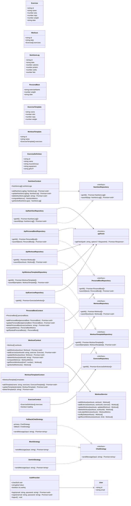

# Class Level Architecture

This class diagram represents the current code structure inside `/src`, including async repository interfaces and the chat strategy module.

```mermaid
classDiagram
  direction LR

  %% Domain entity shapes are based on src/domain/entities/index.ts
  class User {
    +string id
    +string email
  }

  class Exercise {
    +string id
    +string name
    +number sets
    +number reps
    +number weight
    +string date
  }

  class Workout {
    +string id
    +string date
    +Exercise[] exercises
  }

  class NutritionLog {
    +string id
    +string date
    +number calories
    +number protein
    +number carbs
    +number fats
  }

  class PersonalBest {
    +string exerciseName
    +number weight
    +string date
  }

  class ExerciseTemplate {
    +string name
    +number sets
    +number reps
    +number weight
  }

  class WorkoutTemplate {
    +string id
    +string name
    +ExerciseTemplate[] exercises
  }

  class ExerciseDefinition {
    +string id
    +string name
    +string muscleGroup
    +string equipment
    +string gifUrl?
  }

  class WorkoutRepository {
    <<interface>>
    +getAll() Promise~Workout[]~
    +saveAll(workouts: Workout[]) Promise~void~
  }

  class NutritionRepository {
    <<interface>>
    +getAll() Promise~NutritionLog[]~
    +saveAll(logs: NutritionLog[]) Promise~void~
  }

  class PersonalBestRepository {
    <<interface>>
    +getAll() Promise~PersonalBest[]~
    +saveAll(bests: PersonalBest[]) Promise~void~
  }

  class WorkoutTemplateRepository {
    <<interface>>
    +getAll() Promise~WorkoutTemplate[]~
    +saveAll(templates: WorkoutTemplate[]) Promise~void~
  }

  class ExerciseRepository {
    <<interface>>
    +getAll() Promise~ExerciseDefinition[]~
  }

  class ApiWorkoutRepository {
    +getAll() Promise~Workout[]~
    +saveAll(workouts: Workout[]) Promise~void~
  }
  class ApiNutritionRepository {
    +getAll() Promise~NutritionLog[]~
    +saveAll(logs: NutritionLog[]) Promise~void~
  }
  class ApiPersonalBestRepository {
    +getAll() Promise~PersonalBest[]~
    +saveAll(bests: PersonalBest[]) Promise~void~
  }
  class ApiWorkoutTemplateRepository {
    +getAll() Promise~WorkoutTemplate[]~
    +saveAll(templates: WorkoutTemplate[]) Promise~void~
  }
  class ApiExerciseRepository {
    +getAll() Promise~ExerciseDefinition[]~
  }

  ApiWorkoutRepository ..|> WorkoutRepository
  ApiNutritionRepository ..|> NutritionRepository
  ApiPersonalBestRepository ..|> PersonalBestRepository
  ApiWorkoutTemplateRepository ..|> WorkoutTemplateRepository
  ApiExerciseRepository ..|> ExerciseRepository

  class WorkoutService {
    +addWorkout(workouts, workout) Workout[]
    +addExercise(workouts, workoutId, exercise) Workout[]
    +updateWorkout(workouts, updatedWorkout) Workout[]
    +deleteWorkout(workouts, workoutId) Workout[]
    +calculateMetrics(workouts) WorkoutMetrics
    +sortByDate(workouts) Workout[]
    +getRecentWorkouts(workouts, limit) Workout[]
  }

  class ChatStrategy {
    <<interface>>
    +sendMessage(input: string) Promise~string~
  }
  class GeminiStrategy {
    +sendMessage(input: string) Promise~string~
  }
  class MockStrategy {
    +sendMessage(input: string) Promise~string~
  }
  class FallbackChatStrategy {
    -primary: ChatStrategy
    -fallback: ChatStrategy
    +sendMessage(input: string) Promise~string~
  }

  GeminiStrategy ..|> ChatStrategy
  MockStrategy ..|> ChatStrategy
  FallbackChatStrategy ..|> ChatStrategy

  class apiFetch {
    <<function>>
    +apiFetch(path: string, options?: RequestInit) Promise~Response~
  }

  ApiWorkoutRepository --> apiFetch
  ApiNutritionRepository --> apiFetch
  ApiPersonalBestRepository --> apiFetch
  ApiWorkoutTemplateRepository --> apiFetch
  ApiExerciseRepository --> apiFetch

  class WorkoutContext {
    +Workout[] workouts
    +addWorkout(workout: Workout) Promise~void~
    +addExercise(workoutId: string, exercise: Exercise) Promise~void~
    +updateWorkout(workout: Workout) Promise~void~
    +deleteWorkout(workoutId: string) Promise~void~
    +computeMetrics() WorkoutMetrics
    +getRecentWorkouts(limit?: number) Workout[]
    +getSortedWorkouts() Workout[]
  }

  class NutritionContext {
    +NutritionLog[] nutritionLogs
    +addNutritionLog(log: NutritionLog) Promise~void~
    +updateNutritionLog(log: NutritionLog) Promise~void~
    +deleteNutritionLog(logId: string) Promise~void~
    +computeMetrics() NutritionMetrics
    +getSortedNutritionLogs() NutritionLog[]
  }

  class PersonalBestContext {
    +PersonalBest[] personalBests
    +addPersonalBest(personalBest: PersonalBest) Promise~void~
    +updatePersonalBest(personalBest: PersonalBest) Promise~void~
    +deletePersonalBest(exerciseName: string) Promise~void~
    +computeMetrics() PersonalBestMetrics
    +getRankedPersonalBests() PersonalBest[]
  }

  class WorkoutTemplateContext {
    +WorkoutTemplate[] templates
    +addTemplate(name: string, exercises: ExerciseTemplate[]) Promise~void~
    +updateTemplate(template: WorkoutTemplate) Promise~void~
    +deleteTemplate(id: string) Promise~void~
  }

  class ExerciseContext {
    +ExerciseDefinition[] exercises
    +boolean loading
  }

  class AuthProvider {
    +User|Null user
    +string|Null token
    +boolean isLoading
    +login(email: string, password: string) Promise~void~
    +register(email: string, password: string) Promise~void~
    +logout() void
  }

  WorkoutContext --> WorkoutService
  WorkoutContext --> WorkoutRepository

  NutritionContext --> NutritionRepository
  PersonalBestContext --> PersonalBestRepository
  WorkoutTemplateContext --> WorkoutTemplateRepository
  ExerciseContext --> ExerciseRepository

  AuthProvider --> User
```
