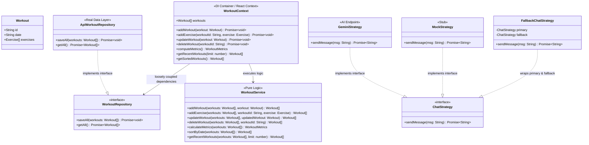

# Class Level Architecture

This Class Diagram is a direct representation of our real Domain-Driven codebase hierarchy within `/src`.

```mermaid
classDiagram
    %% Core Entities (DTOs passed between layers)
    class Workout {
        +String id
        +String date
        +Exercise[] exercises
    }

    %% Interfaces (in src/application/interfaces/)
    class WorkoutRepository {
        <<interface>>
        +saveAll(workouts: Workout[]) Promise~void~
        +getAll() Promise~Workout[]~
    }

    class ChatStrategy {
        <<interface>>
        +sendMessage(msg: String) Promise~String~
    }

    %% Concrete Implementations (in src/infrastructure/)
    class ApiWorkoutRepository {
        <<Real Data Layer>>
        +saveAll(workouts: Workout[]) Promise~void~
        +getAll() Promise~Workout[]~
    }

    class GeminiStrategy {
        <<AI Endpoint>>
        +sendMessage(msg: String) Promise~String~
    }

    class MockStrategy {
        <<Stub>>
        +sendMessage(msg: String) Promise~String~
    }

    class FallbackChatStrategy {
        -ChatStrategy primary
        -ChatStrategy fallback
        +sendMessage(msg: String) Promise~String~
    }

    %% Services (in src/application/workout/)
    class WorkoutService {
        <<Pure Logic>>
        +addWorkout(workouts: Workout[], workout: Workout) Workout[]
        +addExercise(workouts: Workout[], workoutId: String, exercise: Exercise) Workout[]
        +updateWorkout(workouts: Workout[], updatedWorkout: Workout) Workout[]
        +deleteWorkout(workouts: Workout[], workoutId: String) Workout[]
        +calculateMetrics(workouts: Workout[]) WorkoutMetrics
        +sortByDate(workouts: Workout[]) Workout[]
        +getRecentWorkouts(workouts: Workout[], limit: number) Workout[]
    }

    %% Presentation / State (in src/application/workout/)
    class WorkoutContext {
        <<DI Container / React Context>>
        +Workout[] workouts
        +addWorkout(workout: Workout) Promise~void~
        +addExercise(workoutId: String, exercise: Exercise) Promise~void~
        +updateWorkout(workout: Workout) Promise~void~
        +deleteWorkout(workoutId: String) Promise~void~
        +computeMetrics() WorkoutMetrics
        +getRecentWorkouts(limit: number) Workout[]
        +getSortedWorkouts() Workout[]
    }

    %% Relationships Mapping Back to Code
    ApiWorkoutRepository ..|> WorkoutRepository : implements interface
    GeminiStrategy ..|> ChatStrategy : implements interface
    MockStrategy ..|> ChatStrategy : implements interface
    FallbackChatStrategy ..|> ChatStrategy : wraps primary & fallback

    WorkoutContext --> WorkoutService : executes logic
    WorkoutContext --> WorkoutRepository : loosely coupled dependencies
```
