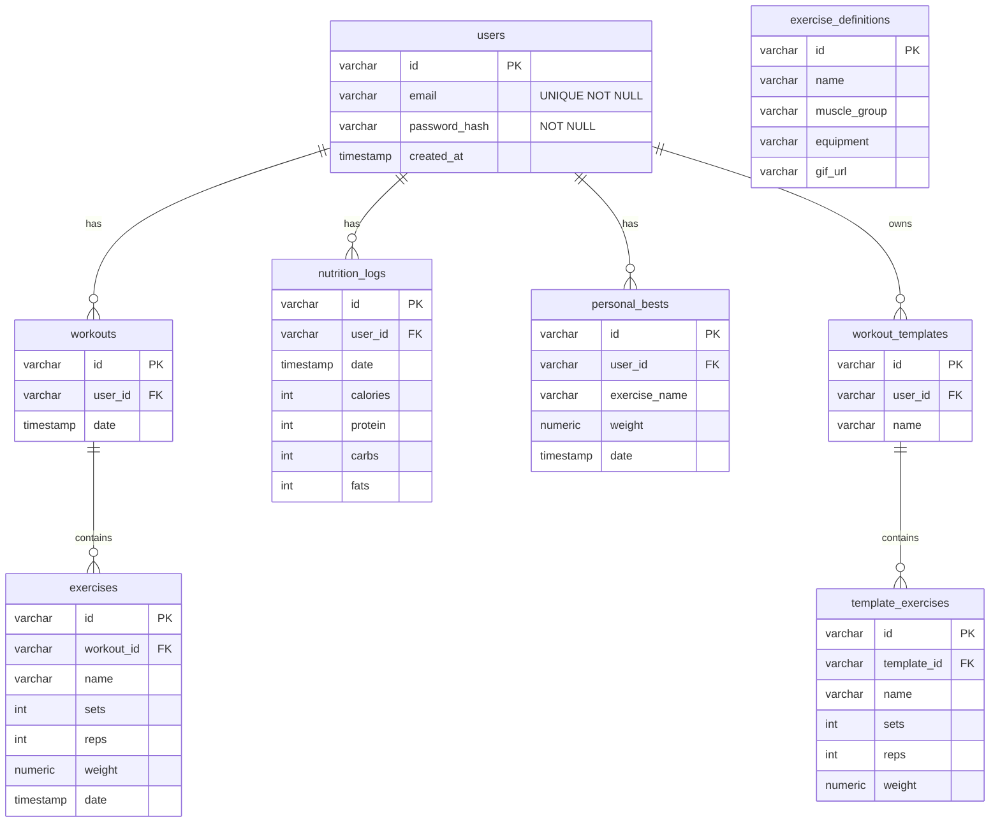

# Relational Entity Diagram

This ER diagram directly represents the structure instantiated inside our actual PostgreSQL database (via `backend/init-db.js`).

```mermaid
erDiagram
  users ||--o{ workouts : "has"
  workouts ||--o{ exercises : "contains"

  users ||--o{ nutrition_logs : "has"
  users ||--o{ personal_bests : "has"

  users ||--o{ workout_templates : "owns"
  workout_templates ||--o{ template_exercises : "contains"

  users {
    varchar id PK
    varchar email "UNIQUE NOT NULL"
    varchar password_hash "NOT NULL"
    timestamp created_at
  }

  workouts {
    varchar id PK
    varchar user_id FK
    timestamp date
  }

  exercises {
    varchar id PK
    varchar workout_id FK
    varchar name
    int sets
    int reps
    numeric weight
    timestamp date
  }

  nutrition_logs {
    varchar id PK
    varchar user_id FK
    timestamp date
    int calories
    int protein
    int carbs
    int fats
  }

  personal_bests {
    varchar id PK
    varchar user_id FK
    varchar exercise_name
    numeric weight
    timestamp date
    %% UNIQUE(user_id, exercise_name)
  }

  workout_templates {
    varchar id PK
    varchar user_id FK
    varchar name
  }

  template_exercises {
    varchar id PK
    varchar template_id FK
    varchar name
    int sets
    int reps
    numeric weight
  }

  exercise_definitions {
    varchar id PK
    varchar name
    varchar muscle_group
    varchar equipment
    varchar gif_url
  }
```
