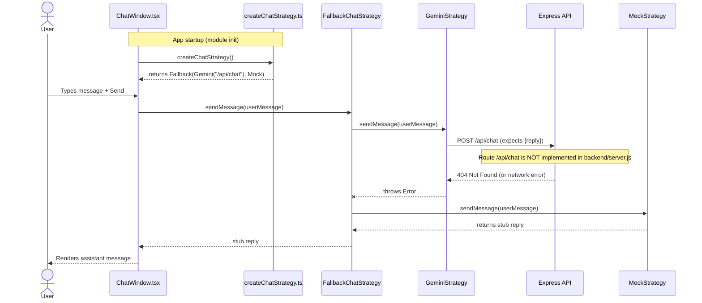

# Execution Sequence (AI Fallback Path)

This diagram tracks the execution flow of the AI module in `src/application/chat`. It reflects the current codebase, where the frontend calls `/api/chat` but `backend/server.js` does not implement that route—so the primary strategy fails and fallback returns a mock reply.

