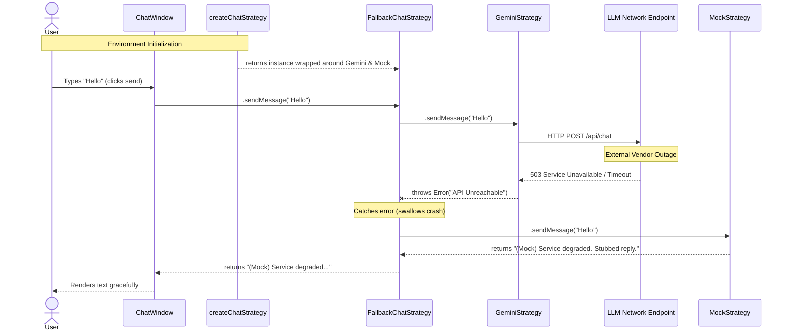

# Execution Sequence (AI Fallback Path)

This diagram tracks the literal execution flow of the AI module built in `src/application/chat`, demonstrating how `FallbackChatStrategy.ts` prevents system crashes when `GeminiStrategy.ts` fails.

