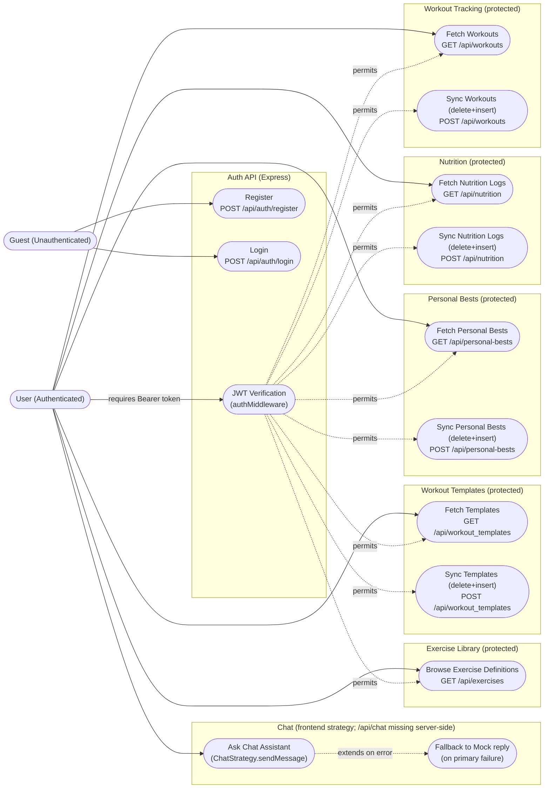

# System Capabilities

This diagram represents the user interactions implemented by the current Express backend in `backend/server.js` (JWT-protected routes + public auth routes).

```mermaid
flowchart LR
  %% Actors
  Guest(["Guest (Unauthenticated)"])
  User(["User (Authenticated)"])

  subgraph Auth["Auth API (Express)"]
    direction TB
    UC_Register(["Register<br/>POST /api/auth/register"])
    UC_Login(["Login<br/>POST /api/auth/login"])
    UC_JWT(["JWT Verification<br/>(authMiddleware)"])
  end

  Guest --> UC_Register
  Guest --> UC_Login
  User -->|requires Bearer token| UC_JWT

  subgraph Workouts["Workout Tracking (protected)"]
    direction TB
    UC_GetWorkouts(["Fetch Workouts<br/>GET /api/workouts"])
    UC_SyncWorkouts(["Sync Workouts (delete+insert)<br/>POST /api/workouts"])
  end

  subgraph Nutrition["Nutrition (protected)"]
    direction TB
    UC_GetNutrition(["Fetch Nutrition Logs<br/>GET /api/nutrition"])
    UC_SyncNutrition(["Sync Nutrition Logs (delete+insert)<br/>POST /api/nutrition"])
  end

  subgraph PB["Personal Bests (protected)"]
    direction TB
    UC_GetPB(["Fetch Personal Bests<br/>GET /api/personal-bests"])
    UC_SyncPB(["Sync Personal Bests (delete+insert)<br/>POST /api/personal-bests"])
  end

  subgraph Templates["Workout Templates (protected)"]
    direction TB
    UC_GetTemplates(["Fetch Templates<br/>GET /api/workout_templates"])
    UC_SyncTemplates(["Sync Templates (delete+insert)<br/>POST /api/workout_templates"])
  end

  subgraph Exercises["Exercise Library (protected)"]
    direction TB
    UC_GetExerciseDefs(["Browse Exercise Definitions<br/>GET /api/exercises"])
  end

  UC_JWT -.permits.-> UC_GetWorkouts
  UC_JWT -.permits.-> UC_SyncWorkouts
  UC_JWT -.permits.-> UC_GetNutrition
  UC_JWT -.permits.-> UC_SyncNutrition
  UC_JWT -.permits.-> UC_GetPB
  UC_JWT -.permits.-> UC_SyncPB
  UC_JWT -.permits.-> UC_GetTemplates
  UC_JWT -.permits.-> UC_SyncTemplates
  UC_JWT -.permits.-> UC_GetExerciseDefs

  User --> UC_GetWorkouts
  User --> UC_GetNutrition
  User --> UC_GetPB
  User --> UC_GetTemplates
  User --> UC_GetExerciseDefs

  subgraph Chat["Chat (frontend strategy; /api/chat missing server-side)"]
    direction TB
    UC_Chat(["Ask Chat Assistant<br/>(ChatStrategy.sendMessage)"])
    UC_ChatFallback(["Fallback to Mock reply<br/>(on primary failure)"])
    UC_Chat -.extends on error.-> UC_ChatFallback
  end

  User --> UC_Chat
```
