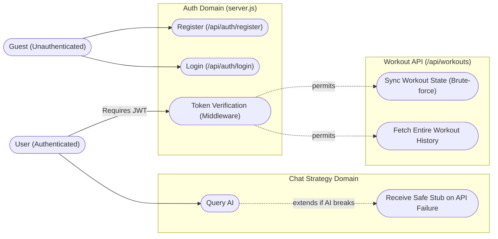

# System Capabilities

This diagram represents the strict user interactions bounded by the JWT Auth middleware present in `backend/server.js`.

```mermaid
flowchart LR
    %% Actors
    Guest(["Guest (Unauthenticated)"])
    User(["User (Authenticated)"])

    subgraph Auth_Domain ["Auth Domain (server.js)"]
        direction TB
        UC1(["Register (/api/auth/register)"])
        UC2(["Login (/api/auth/login)"])
        UC3(["Token Verification (Middleware)"])
    end
    
    Guest --> UC1
    Guest --> UC2
    
    User -->|Requires JWT| UC3

    subgraph Workout_API ["Workout API (/api/workouts)"]
        direction TB
        UC4(["Sync Workout State (Brute-force)"])
        UC5(["Fetch Entire Workout History"])
    end

    subgraph Chat_Strategy_Domain ["Chat Strategy Domain"]
        direction TB
        UC6(["Query AI"])
        UC7(["Receive Safe Stub on API Failure"])
    end

    UC3 -.->|permits| UC4
    UC3 -.->|permits| UC5
    
    User --> UC6
    UC6 -.->|extends if AI breaks| UC7
```
